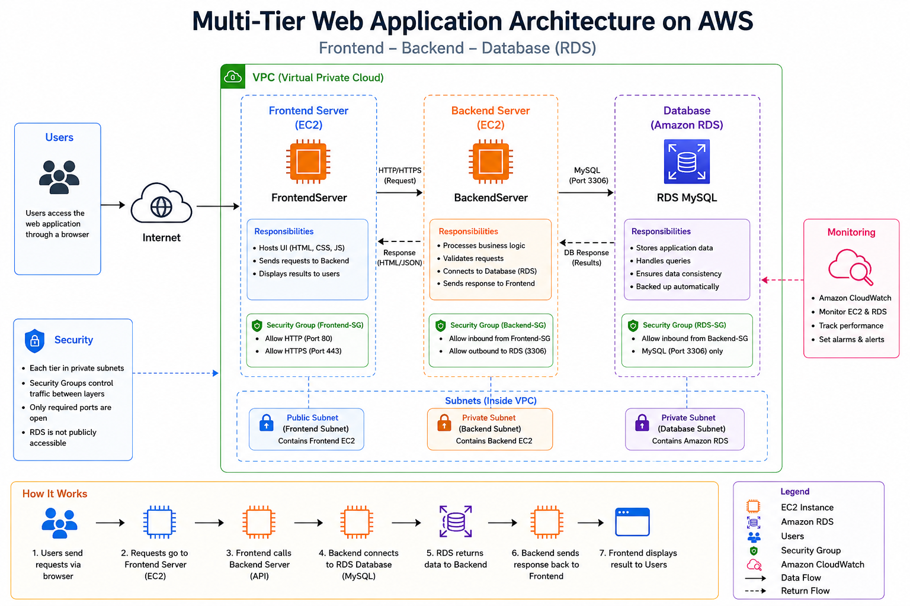
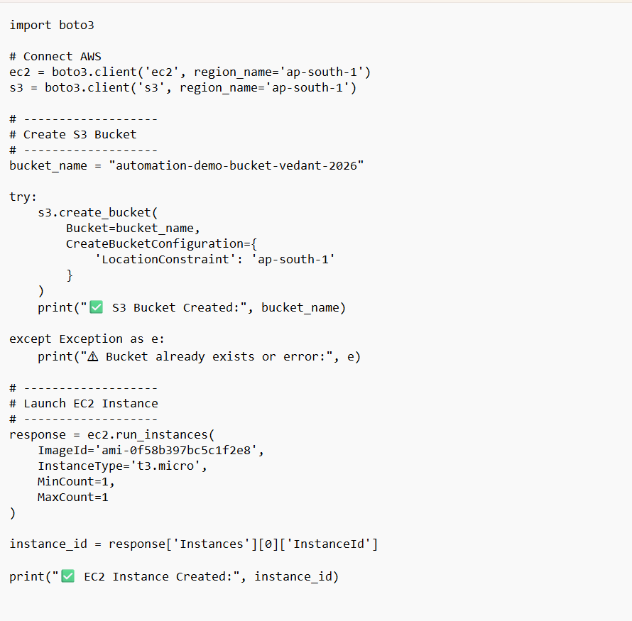
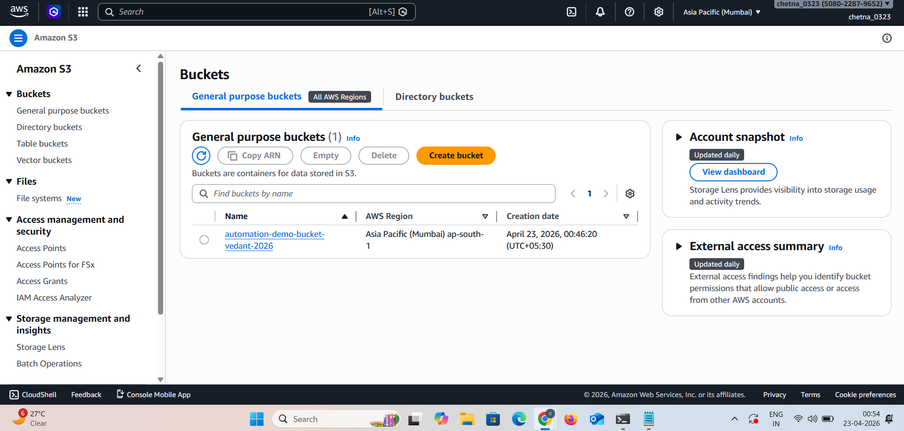
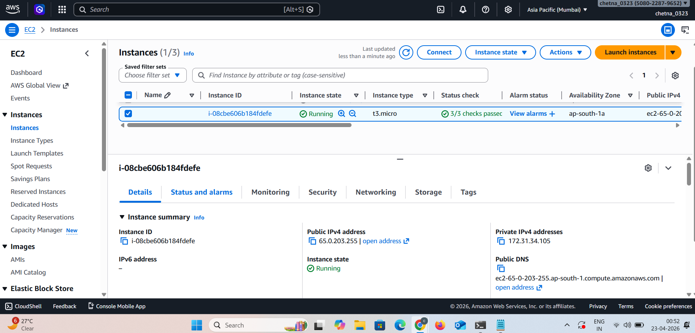
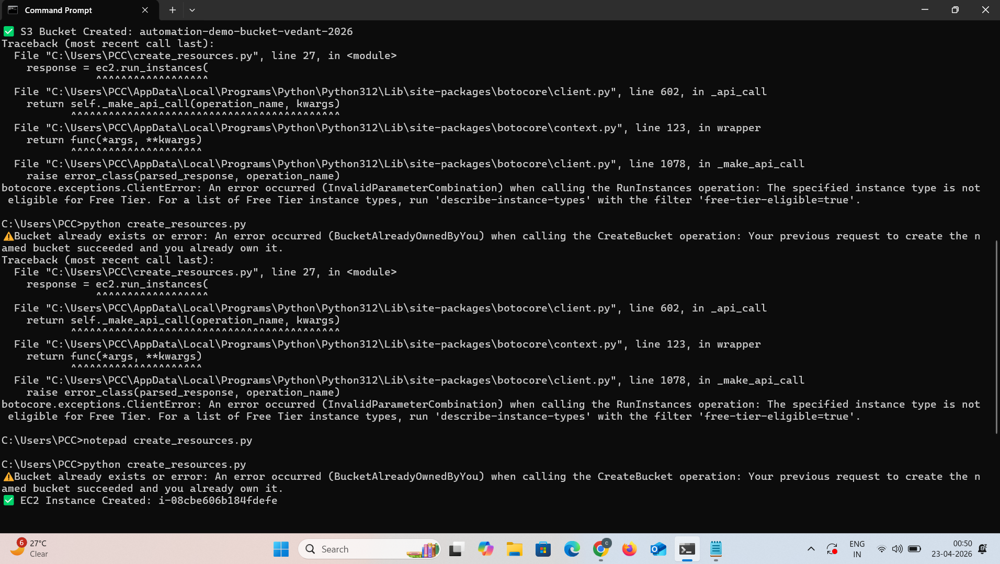

🚀 Automate AWS Resource Provisioning (EC2 + S3 using boto3)


---

📌 Project Overview

This project demonstrates how to **automate AWS resource provisioning** using Python and the **boto3 library**.

Instead of manually creating resources from the AWS Console, the script automatically:

- Creates an **S3 Bucket**
- Launches an **EC2 Instance**

---

🎯 Purpose

- Automate AWS infrastructure setup  
- Reduce manual effort  
- Save time  
- Avoid human errors  
- Learn Infrastructure as Code (IaC)  

---

🧰 AWS Services Used

- Amazon EC2  
- Amazon S3  
- AWS IAM  
- boto3 (Python SDK)  

---

🏗️ Architecture Diagram



**Flow:**

User → Python Script → boto3 → AWS (S3 + EC2)

---

💻 Python Script



This script:

- Connects to AWS  
- Creates an S3 bucket  
- Launches an EC2 instance  

---

☁️ S3 Bucket Creation



The S3 bucket is created successfully using the boto3 script.

---

🖥️ EC2 Instance Creation



The EC2 instance is launched automatically using the script.

---

🧾 Command Prompt Output



Shows:

- Bucket creation success  
- Error handling (bucket already exists)  
- EC2 instance creation confirmation  

---

🔥 Key Features

- Fully automated AWS provisioning  
- Uses Python boto3 SDK  
- Error handling implemented  
- Simple and reusable script  
- Beginner-friendly DevOps project  

---

📁 Project Structure

```
Automate-AWS-Resource-Provisioning/
│── create_resources.py
│── README.md
│── screenshots/
│    ├── architecture.png
│    ├── code.png
│    ├── s3.png
│    ├── ec2.png
│    ├── output.png
```

---

⚙️ Prerequisites

- AWS Account  
- IAM User (Programmatic access)  
- AWS CLI configured (`aws configure`)  
- Python installed  
- boto3 installed  

```bash
pip install boto3
```

---

▶️ How to Run

```bash
python create_resources.py
```

---

⚠️ Notes

- Use **t2.micro / t3.micro** (Free Tier)  
- Bucket name must be globally unique  
- Ensure IAM permissions:
  - EC2 access  
  - S3 access  

---

🧠 How It Works

1. Script connects to AWS  
2. Creates S3 bucket  
3. Launches EC2 instance  
4. Displays output in terminal  

---

✅ Conclusion

This project demonstrates how to automate AWS resources using **Python (boto3)**, which is an essential skill for:

- DevOps Engineers  
- Cloud Engineers  
- Automation Engineers  

---
